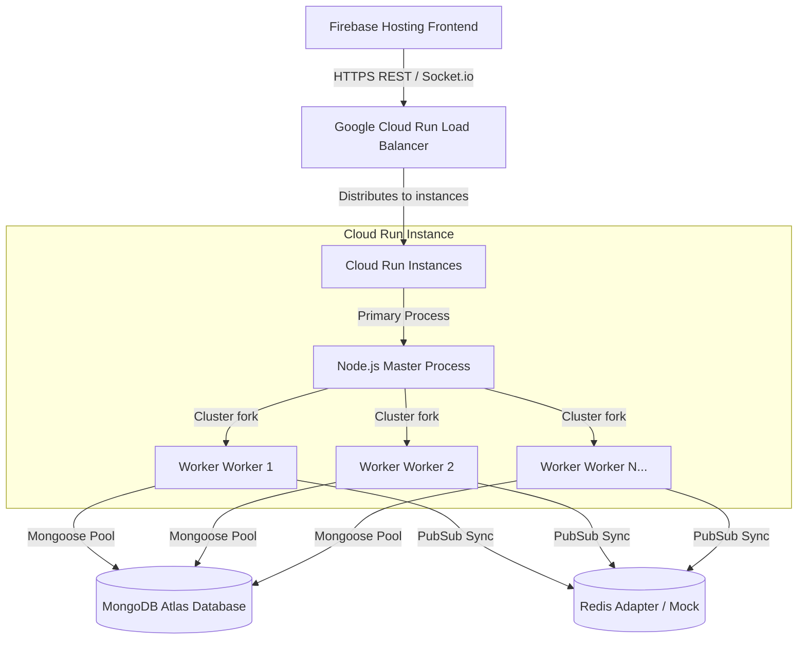
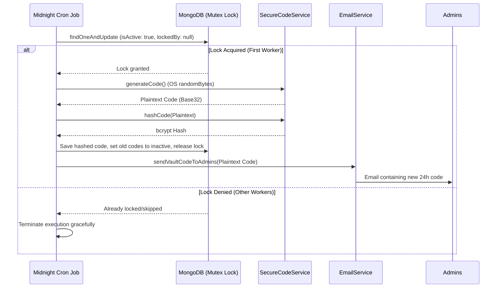

# ZA.go.ke Platform — Technical & System Architecture Guide

Welcome to the comprehensive system documentation for **ZA.go.ke** (Treats & Heat), a modern, high-performance, real-time e-commerce and logistics platform optimized for cloud deployment and zero-latency user experiences.

---

## 1. System Overview & Flow
The ZA.go.ke platform comprises a modern decoupled stack: a **React/Vite Frontend** hosted on **Firebase Hosting** and a load-balanced **Node.js/Express Backend** deployed on **Google Cloud Run**, all backed by a cloud-managed **MongoDB Atlas Database** and integrated real-time web socket layers.



---

## 2. Backend Infrastructure & Load-Balancing (Cluster Mode)
To leverage multi-core compute environments (like 2vCPU / 4vCPU Cloud Run instances), the backend utilizes a native **Node.js Cluster Architecture** to distribute load and optimize memory.

### Key Characteristics:
* **Primary Process:** Initializes database configurations, environment checks, and forks worker processes matching the system's CPU core count (`os.cpus().length`).
* **Worker Processes:** Each worker binds to port `5000` to share HTTP and Socket.io socket connections.
* **Worker Crash Recovery:** If any worker exits unexpectedly (e.g., due to unhandled exceptions), the Primary process detects the exit event and forks a replacement worker immediately to maintain maximum throughput.
* **Fallback Mechanisms:** In local development, if a Redis cluster is missing, the backend degrades gracefully to an internal memory mock, allowing offline work without code adjustments.

---

## 3. Cloud Hosting & Scaling Configuration
The application is engineered to operate with **ultra-low latency**, resolving "cold start" issues using advanced Cloud Run features.

### Zero-Latency Architecture:
* **Warm Standby (`minScale: 5`):** Google Cloud Run is configured to maintain a minimum of 5 warm instances. Incoming requests never encounter a cold container start, ensuring sub-100ms first-contentful paint and request times.
* **CPU Boost (`startup-cpu-boost: true`):** Allocates additional CPU resources during container startup to decrease load and connection times.
* **Memory & Concurrency:** Configured with `2GiB` memory limit and high request concurrency parameters to handle spikes in traffic efficiently.

---

## 4. Secure 24-Hour Vault Code Rotation
To lock and secure premium menus, the platform implements a 24-hour cryptographically secure access code system.



### Security Details:
1. **Entropy Generation:** Plaintext codes are generated via `crypto.randomBytes()`, which draws entropy directly from the OS kernel. It utilizes a **Base32 alphabet** (RFC 4648 without `I`, `O`, `1`, and `0`) to eliminate visual user confusion.
2. **One-Way Cryptographic Storage:** Plaintext codes are never stored in the database. Instead, they are hashed using **bcrypt (12 rounds)**. Verification endpoints verify the code by comparing the input against the bcrypt hash, preventing exposure in the event of database access compromise.
3. **Cluster Mutex Locking:** When running in a multi-instance cluster, the midnight cron job (`0 0 * * *`) uses an atomic MongoDB mutex (`findOneAndUpdate` with transactional locks) to guarantee only one worker generates the new code.
4. **Email Notification:** The plaintext code is immediately emailed to all registered system administrators via NodeMailer (secured by SMTP in production or mocked in development).

---

## 5. Delivery Boundaries & Geofencing
ZA.go.ke enforces delivery limits strictly within Nairobi County using geographical boundary validation.

### Geofencing Pipeline:
* **Nairobi Boundary Polygon:** Defined by 5-point coordinates wrapping Nairobi County.
* **Ray-Casting Algorithm:** Validates location requests. It casts an imaginary ray from the user's coordinate and counts intersections with the polygon edges. Odd intersections place the point inside; even intersections deny it.
* **Socket.io Streaming:** When a courier emits a `courier_update` socket event with their GPS coordinates, the system checks if the coordinate is within Nairobi before updating the map or broadcasting the coordinates to the order's real-time tracker room.

```javascript
const isPointInPolygon = (point, vs) => {
    const x = point[0], y = point[1];
    let inside = false;
    for (let i = 0, j = vs.length - 1; i < vs.length; j = i++) {
        const xi = vs[i][0], yi = vs[i][1];
        const xj = vs[j][0], yj = vs[j][1];

        const intersect = ((yi > y) !== (yj > y)) && (x < (xj - xi) * (y - yi) / (yj - yi) + xi);
        if (intersect) inside = !inside;
    }
    return inside;
};
```

---

## 6. Database & Seeding Strategy
To guarantee instant deployment capability in any fresh environment, the system implements an **Automated Database Seeder** embedded directly in the startup process.

* **Startup Check:** When Mongoose connects to MongoDB, the backend checks if the `Product` collection count is `0`.
* **Instant Population:** If empty, it automatically populates the database with a pre-configured catalog of 20 premium and standard products (Cookies, Sweets, and Drinks).
* **Environment Independence:** Bypasses local IP whitelisting errors by executing directly in the cloud, removing the need for manual administrative data setup.

---

## 7. How to Run the Application

### Local Development Setup:
1. **Clone the Repository:** Navigate to the folder directory.
2. **Backend Setup:**
   ```bash
   cd backend
   npm install
   # Create a .env file with:
   # MONGO_URI=mongodb://localhost:27017/zago
   # JWT_SECRET=your_jwt_secret
   # FRONTEND_URL=http://localhost:3000
   node server.js
   ```
3. **Frontend Setup:**
   ```bash
   cd ../frontend
   npm install
   # Configured by default to communicate with local/dev backends
   npm run dev
   ```

### Production Deployment:
* **Backend:** Deploy changes to Google Cloud Run using standard source compile flags:
  ```bash
  gcloud run deploy zago-backend --source . --region us-central1 --project heat-and-treats --quiet
  ```
* **Frontend:** Build and deploy static assets to Firebase Hosting:
  ```bash
  npm run build
  firebase deploy --only hosting
  ```
